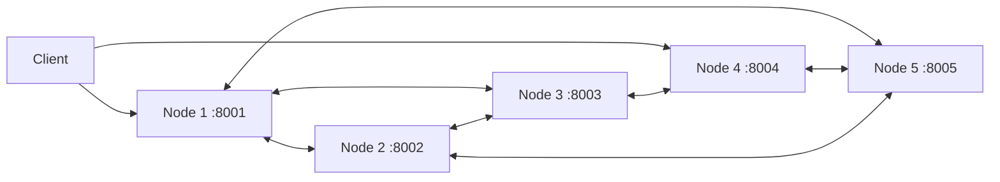

# QuorumDB

QuorumDB is a final-year CSE friendly distributed key-value store written in Go. It demonstrates the main ideas behind Dynamo-style systems: consistent hashing, replication, quorum reads/writes, and gossip-based membership/failure detection.

## Features

- 5-node cluster, each node runs as a separate HTTP process.
- Consistent hashing with virtual nodes to partition keys.
- Replication factor of 3 for every key.
- Quorum writes and reads with `W=2`, `R=2`.
- Gossip membership every 500ms with dead-node detection after 2 seconds.
- REST APIs for `PUT` and `GET`.
- In-memory storage with version timestamps and latest-version conflict resolution.

## Architecture



Any node can act as a coordinator. For a key, the coordinator finds 3 replica nodes from the consistent hash ring, writes to all 3, and returns success after 2 acknowledgements. Reads query the same replica set and return the newest version after 2 successful responses.

## Run Locally

Requirements:

- Go 1.26 or newer.
- PowerShell on Windows.

Start all 5 nodes:

```powershell
.\scripts\start-cluster.ps1
```

Write a key:

```powershell
Invoke-RestMethod -Method Put `
  -Uri http://127.0.0.1:8001/kv/student `
  -Body '{"value":"final-year-cse"}' `
  -ContentType 'application/json'
```

Read the same key from another node:

```powershell
Invoke-RestMethod http://127.0.0.1:8004/kv/student
```

Check membership:

```powershell
Invoke-RestMethod http://127.0.0.1:8002/members
```

Stop the cluster:

```powershell
.\scripts\stop-cluster.ps1
```

## Load Test

After starting the cluster, run:

```powershell
go run .\cmd\loadgen -url http://127.0.0.1:8001 -requests 10000 -concurrency 200 -read-percent 60
```

The load generator prints successful requests, failed requests, throughput, average latency, and P95 latency. Use it to compare how the cluster behaves with different request counts and concurrency levels.

## API

### PUT `/kv/{key}`

Request:

```json
{
  "value": "hello"
}
```

Response:

```json
{
  "key": "name",
  "value": "hello",
  "version": 1778841284000000000,
  "replicas": ["node1", "node3", "node5"],
  "acknowledged": 3,
  "latency": 4200000
}
```

### GET `/kv/{key}`

Returns the latest value found from the read quorum.

### GET `/members`

Shows the gossip membership table, including `alive` status and `last_seen` timestamp.

### GET `/health`

Shows node id, address, local key count, and health status.

## Failure Demo

1. Start the cluster.
2. Write a value through node1.
3. Stop one node manually or run `.\scripts\stop-cluster.ps1` and restart only some nodes.
4. Query `/members` on another node. Within around 2 seconds, the stopped node is marked `alive: false`.
5. Reads/writes continue while at least 2 of the 3 replicas for a key are alive.

## Project Explanation

This project intentionally keeps the storage engine in memory so the distributed systems concepts are clear:

- Consistent hashing decides ownership without a central metadata server.
- Replication improves availability because the same key exists on 3 nodes.
- Quorum operations balance consistency and availability.
- Gossip spreads node health information without one master node.

For production, the next steps would be persistent storage, hinted handoff, anti-entropy repair, TLS, authentication, structured metrics, and stronger conflict resolution such as vector clocks.
